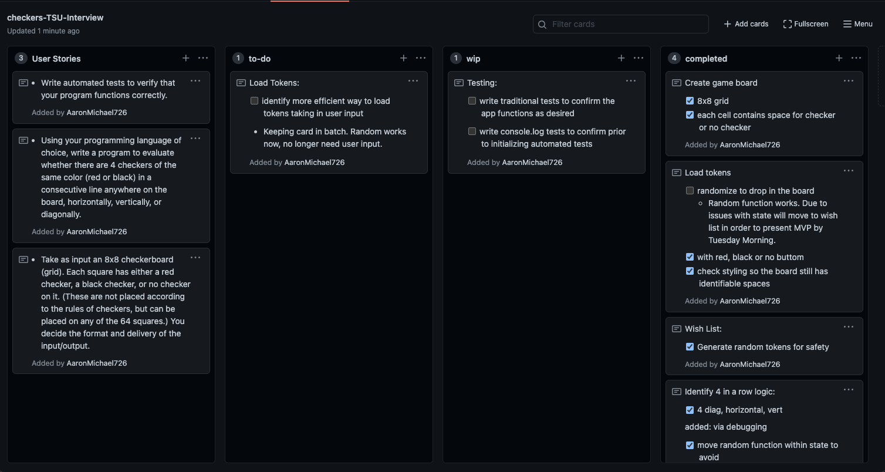
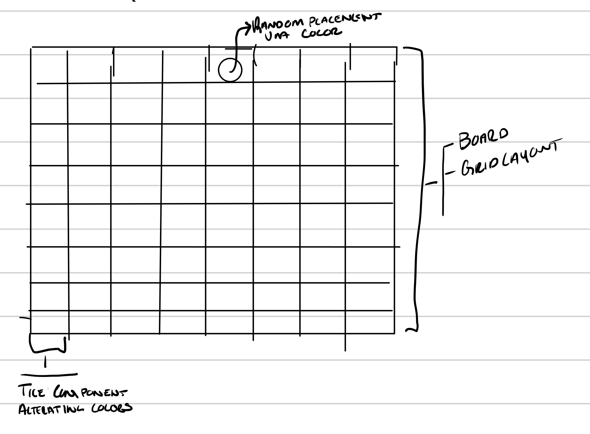
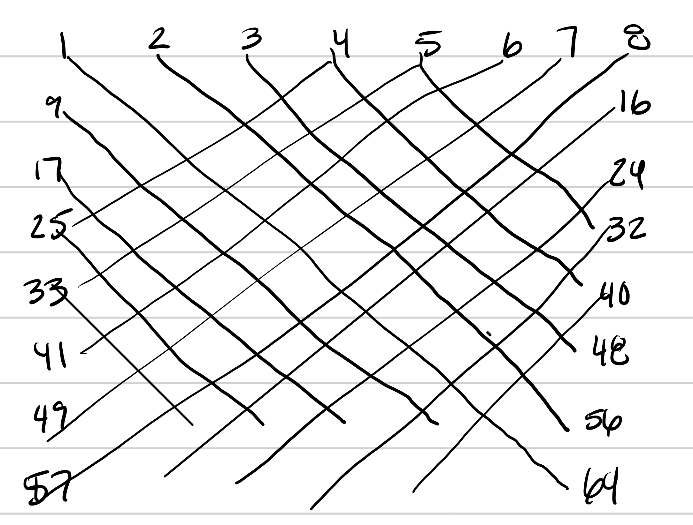
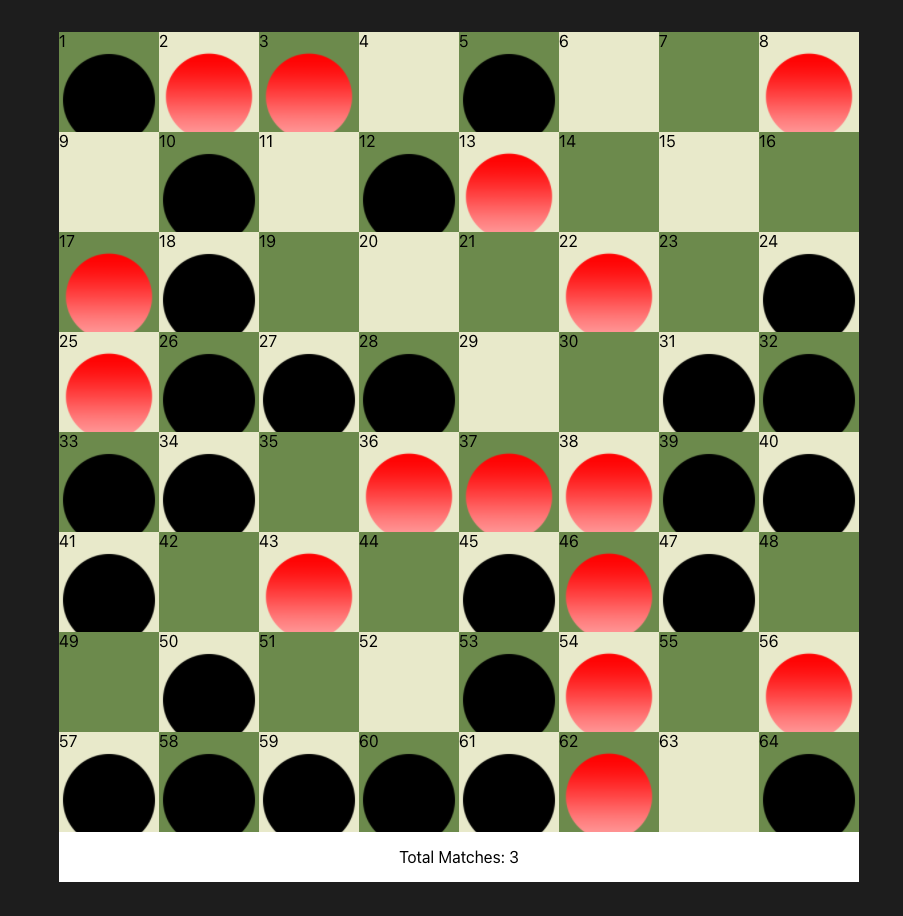

#TSU Technical Interview

Project to be completed as a part of the interview process with Texas State University

Requirements: 
* Take as input an 8x8 checkerboard (grid). Each square has either a red checker, a black checker, or no checker on it. (These are not placed according to the rules of checkers, but can be placed on any of the 64 squares.) You decide the format and delivery of the input/output.
 
* Using your programming language of choice, write a program to evaluate whether there are 4 checkers of the same color (red or black) in a consecutive line anywhere on the board, horizontally, vertically, or diagonally.
 
* Write automated tests to verify that your program functions correctly.

# Process in Completely the Application

### Ideation

The project is to be completed as a checkers board. Tiles will be placed randomly on the board.

A counter at the bottom of the screen with detail. 

As a former program manager, I am proud of the planning I put in to each product. 

Project was planned as a small scrum board to break down the steps to complete.
Project Board Snapshot:

Handwritten Plans: 

This is the intial wireframe where I considered how to make the board in components

How I imagined the diagonal function

### Trouble Areas

Placing the tiles at random proved to be difficult. Initially I instantiated a 2d Array randomly with values being either 0, 1, 2 to indicate if a token would be red, black, or blank.  This however, called the random function repeatedly leaving me with an Array that was not accurate to the board placement.

After many tests, and debugging, I realized I could keep the state of the Array by initializing it inside of a separate JS file and import into my App file. Allowing me to pass the array through Prop and complete my "win-logic" in a separate component.

### Tests

Automated tests proved to be difficult with the design. This is an Area that I overlooked as I'm used to testing for rendered components and desired states. However, on "start" all components are rendered and nothing changes throughout the application. 

As a point of candor, I ran out of time. Were I to have more time, I would update the application to include separate buttons and input from the EndUser and test each component separately. Unfortunately, I spent too much time testing the "win-logic" and developing the randomized board placement.

I did this through separate functions, and logs, and several end-to-end tests checking by hand. 

### Final Product

